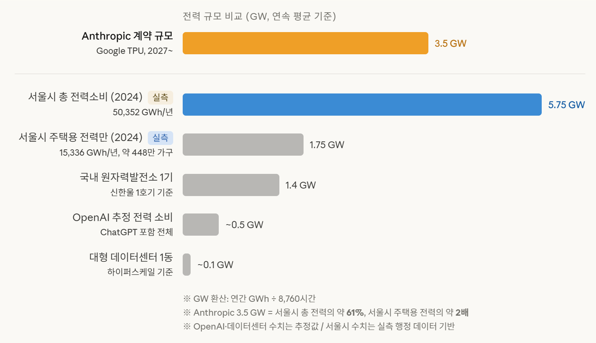

AI WEEKLY
2026.04.07

Anthropic, 매출 $30B 돌파하며 OpenAI 첫 추월

Google·Broadcom과 3.5GW 규모 차세대 TPU 장기 공급 계약 체결

연매출 런레이트 <strong>$30B</strong> (OpenAI $25B 역전)
 15개월 만에 $1B → $30B · 성장률 10배/년

TPU 컴퓨팅 <strong>3.5GW</strong>
 2027년부터 Broadcom 공급, 2031년까지 계약

Broadcom (칩 제조) → Google (클라우드 제공) → Anthropic (Claude 운영)

출처: TechCrunch, Bloomberg · 2026.04.07

---

AI WEEKLY
2026.04.09

k-skill — 귀찮은 건 AI 에이전트에게 시키세요

Claude Code, Codex, OpenCode 등 각종 코딩 에이전트에서 바로 사용 가능

<strong>26+</strong>개 한국 생활 스킬
 SRT 예약 · KTX 예매 · 쿠팡 검색 · 미세먼지 조회

GitHub Stars <strong>2.3k</strong>
 MIT 라이선스 · API 키 없이 사용

한국인이라면 다운로드 해두세요.
 언젠가 무조건 쓸 때가 옵니다.

출처: GitHub NomaDamas/k-skill

