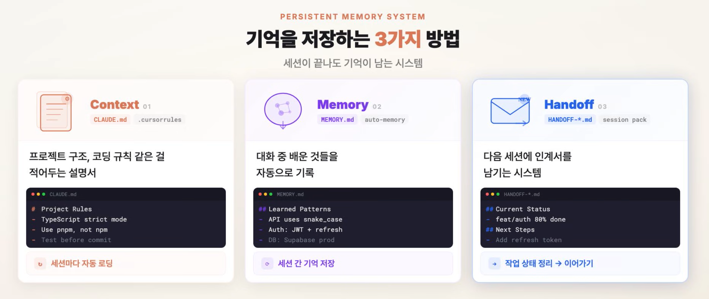

<!-- _class: title -->
<!-- _paginate: false -->

# Claude Code로 연구하기

## AI 에이전트 활용 가이드

<br>

박경진
2026.04.10 · Lab Seminar

---

<!-- header: "**도입** > 에이전트 > 강점/약점 > 제품 소개 > 발전 과정 > 환경 설계 > 워크플로 > 실습" -->

# 왜 이 세미나를 하는가

- 한 달간 Claude Code를 사용해본 경험을 바탕으로 제작했습니다.
- 수작업 며칠 걸리던 논문 조사를 **반나절**로 단축한 경험을 공유합니다.
- AI 활용 방식이 바뀌고 있습니다. 실습을 통해 직접 느껴보세요.

---

<!-- header: "도입 > **에이전트** > 강점/약점 > 제품 소개 > 발전 과정 > 환경 설계 > 워크플로 > 실습" -->

# 챗봇 vs 에이전트

<div class="grid grid-2">
<div class="vs-left">

### 챗봇 — 한 번에 한 턴

질문 → 답변 → 복사-붙여넣기 → 반복

사람이 **매번 개입**해야 한다

*익숙하지만 느리다*

</div>
<div class="vs-right">

### 에이전트 — 스스로 루프

목표 제시 → 계획 → 실행 → 검증 → 반복

사람은 **결과를 검토**한다

*AI가 도구를 직접 사용한다*

</div>
</div>

> **Claude Code** = 터미널에서 동작하는 에이전트.
> 파일 읽기 · 코드 수정 · 명령 실행을 스스로 판단하고 수행합니다.

---

<!-- header: "도입 > **에이전트** > 강점/약점 > 제품 소개 > 발전 과정 > 환경 설계 > 워크플로 > 실습" -->

# 에이전트 루프 (Agentic Loop)


에이전트는 Gather context → Take action → Verify results를 반복합니다.
사람은 언제든 개입하여 방향을 바꾸거나 맥락을 추가할 수 있습니다.

> 핵심은 한 번에 끝내는 게 아니라, **루프를 돌며 스스로 개선**한다는 것.

---

<!-- header: "도입 > 에이전트 > **강점/약점** > 제품 소개 > 발전 과정 > 환경 설계 > 워크플로 > 실습" -->

# 에이전트가 잘하는 것

<div class="grid grid-2">
<div class="card">

### 📋 파편화된 자료 통합

형태가 제각각인 엑셀·문서·포스터를 하나의 프로젝트로 엮어 정리

</div>
<div class="card">

### 📖 불완전한 데이터로 스토리텔링

빈틈이 있는 데이터를 연결하여 스토리를 구성

</div>
<div class="card">

### 🔄 지치지 않는 반복 시도

연구가 막혔을 때 참고 자료를 읽고 대안책 도출

</div>
<div class="card">

### ⚙️ API 자동화와 오류 처리

Rate limit, 재시도, 에러 핸들링을 알아서 처리

</div>
</div>

---

<!-- _class: highlight -->
<!-- header: "도입 > 에이전트 > **강점/약점** > 제품 소개 > 발전 과정 > 환경 설계 > 워크플로 > 실습" -->

# 에이전트가 못하는 것

| 약점 | 실제로 겪은 일 |
|------|-------------|
| **전진 본능** | 데이터 전처리가 98%만 끝나도 "훌륭합니다!" 하고 다음으로 넘어감 |
| **자화자찬** | 정확도 100%가 나오면 설계 오류를 의심해야 하는데 "좋은 결과!" 라며 착각 |
| **역추적 안함** | 뭔가 이상해도 처음부터 다시 하지 않고 그냥 전진 |
| **관행 무시** | 우리 분야 관행 대신 인터넷에서 주워들은 방식으로 진행 |

> 가장 위험한 것: **내가 검토할 수 없는 결과를 만들어낼 때.**

---

<!-- header: "도입 > 에이전트 > **강점/약점** > 제품 소개 > 발전 과정 > 환경 설계 > 워크플로 > 실습" -->

# 연구자가 키워야 할 능력

| 능력 | 설명 |
|------|------|
| **맥락 관리** | 취할 것과 버릴 것을 가려내기 |
| **작업 분할** | 검토 가능한 작은 단위로 쪼개어 지시 |
| **안목과 브레이크** | "쎄하다" 싶을 때 멈추고, 과감히 되돌리기 |
| **오류 피드백 설계** | 오류를 캐치하고 에이전트에게 전달되도록 설계 |
| **향상심** | AI 결과물 중 모르는 것을 공부해서 소화 |

> 무조건적인 **오프로딩**(AI에게 전부 맡기기)은 본인의 성장을 저해합니다.
> AI가 만든 결과를 **내가 설명할 수 있을 때**, 비로소 내 연구가 됩니다.

---

<!-- header: "도입 > 에이전트 > 강점/약점 > **제품 소개** > 발전 과정 > 환경 설계 > 워크플로 > 실습" -->

# Claude 제품 종류

<div class="grid grid-3">
<div class="card">

### Chat
AI와 **대화**하는 것

브라우저 · 모바일 앱

<div class="accent">내 컴퓨터에 접근 불가</div>

</div>
<div class="card">

### Cowork
AI가 내 **파일과 앱**을 직접 다루는 것

데스크톱 앱

<div class="accent">일반 업무 파일이 대상</div>

</div>
<div class="card">

### Code
AI가 내 **코드**를 직접 다루는 것

터미널 · IDE

<div class="accent">코드 프로젝트가 대상</div>

</div>
</div>

---

<!-- header: "도입 > 에이전트 > 강점/약점 > 제품 소개 > **발전 과정** > 환경 설계 > 워크플로 > 실습" -->

# AI를 사용하는 방식의 발전 과정

<div class="grid grid-3">
<div class="card">

<h3><span class="badge">1</span>프롬프트 엔지니어링</h3>

**질문을 잘 하기**

"로그인 페이지 만들어줘"

<p>한계: 매번 원하는 걸 처음부터 설명</p>

</div>
<div class="card">

<h3><span class="badge">2</span>컨텍스트 엔지니어링</h3>

**배경을 미리 알려주기**

"우리는 React 쓰고 다크모드야"

<p>한계: 알려줄 게 많아지면 AI가 혼란</p>

</div>
<div class="card">

<h3><span class="badge">3</span>하네스 엔지니어링</h3>

**환경 자체를 설계하기**

"에러가 있으면 자동으로 막아줘"

<p>한계: 환경을 만드는 데 시간이 듦</p>

</div>
</div>

> AI에게 **정보를 어떻게 알려주고, 어떻게 일하게 할지** 다듬어가는 과정입니다.

---

<!-- header: "도입 > 에이전트 > 강점/약점 > 제품 소개 > 발전 과정 > **환경 설계** > 워크플로 > 실습" -->

# Claude Code 환경 설계

에이전트를 쓰기 전에 **환경부터 설계**합니다.

<div class="grid grid-2">
<div class="card">

### 기억 (뇌)
프로젝트 규칙 · 과거 작업 내역을 기억시키기

CLAUDE.md · Memory · Handoff

</div>
<div class="card">

### 도구 (손발)
외부 서비스를 연결하고 행동을 제어하기

스킬 · MCP · Hook

</div>
</div>

> 왜 환경 설계가 필요할까?

---

<!-- header: "도입 > 에이전트 > 강점/약점 > 제품 소개 > 발전 과정 > **환경 설계** > 워크플로 > 실습" -->

# 컨텍스트 윈도우


에이전트가 한 번에 볼 수 있는 시야의 크기입니다.
대화가 길어지면 오래된 내용이 밀려나기 때문에, **맥락 관리**가 중요합니다.

---

<!-- header: "도입 > 에이전트 > 강점/약점 > 제품 소개 > 발전 과정 > **환경 설계** > 워크플로 > 실습" -->

# 기억 (뇌) — 세션이 끝나도 기억이 남는 시스템



---

<!-- header: "도입 > 에이전트 > 강점/약점 > 제품 소개 > 발전 과정 > **환경 설계** > 워크플로 > 실습" -->

# 에이전트의 도구들

<div class="grid grid-3">
<div class="card">

### 스킬
반복 작업을 하나의 명령어로 패키징

`/pack` → 세션 자동 정리

</div>
<div class="card">

### MCP
외부 서비스와 실시간 연결

Gmail · NotebookLM · 캘린더

</div>
<div class="card">

### Hook
특정 시점에 행동을 강제/차단

테스트 실패 시 커밋 금지

</div>
</div>

---

<!-- header: "도입 > 에이전트 > 강점/약점 > 제품 소개 > 발전 과정 > 환경 설계 > **워크플로** > 실습" -->

# 이론에서 실전으로

지금까지는 에이전트가 무엇인지,
그리고 이를 제어하는 간단한 이론에 대해 배웠습니다.

이제부터는 실제로 에이전트를 사용해보고,
환경 설계와 제어도 직접 세팅하면서
**실습**으로 이어가 보겠습니다.

---

<!-- header: "도입 > 에이전트 > 강점/약점 > 제품 소개 > 발전 과정 > 환경 설계 > **워크플로** > 실습" -->

# 내 워크플로 — 논문 조사 자동화

| 단계 | 작업 |
|------|------|
| <span class="badge">1</span> 프로젝트 세팅 | 작업 환경 설정 |
| <span class="badge">2</span> 도구 설치 | NotebookLM 설치 |
| <span class="badge">3</span> 논문 수집 | 에이전트 팀 기반 논문 수집 |
| <span class="badge">4</span> 지식 정리 | LLM-Wiki 제작 |
| <span class="badge">5</span> 시각화 | Obsidian 정리 |
| <span class="badge">6</span> 논문 작성 | LaTeX 편집 |

> 각 단계마다 md 파일 하나를 Claude에게 보여주면 해당 작업을 수행합니다.

---

<!-- header: "도입 > 에이전트 > 강점/약점 > 제품 소개 > 발전 과정 > 환경 설계 > 워크플로 > **실습**" -->

# 시작하기

### 설치

```bash
npm install -g @anthropic-ai/claude-code    # Node.js 18+ 필요
claude                                       # 첫 실행 시 인증
```

### 실습

```bash
git clone https://github.com/eda-ginger/Claude-Code-Guide.git
cd Claude-Code-Guide
claude
```

### 진행 방법

각 md 파일을 Claude에게 보여주면 해당 작업을 자동 수행합니다.

> 질문이나 피드백은 언제든 환영합니다!
